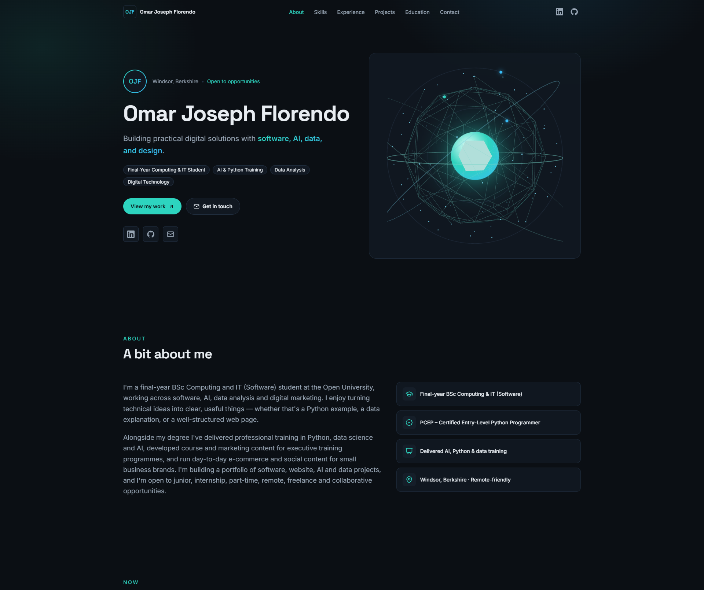
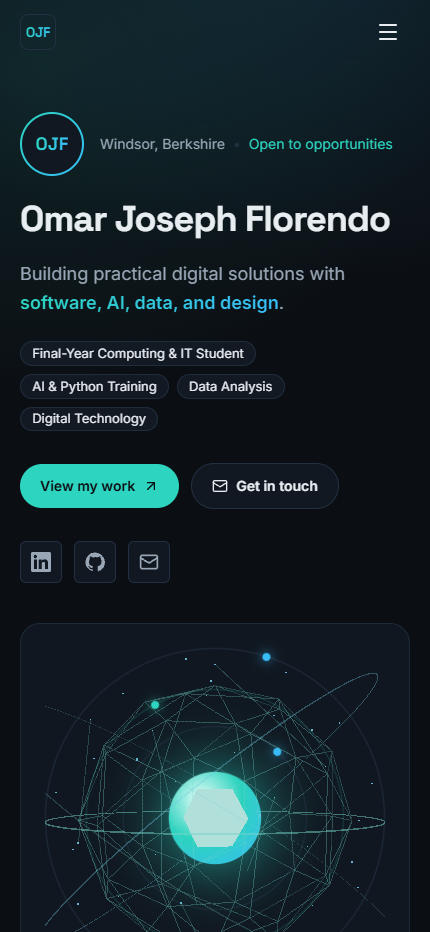
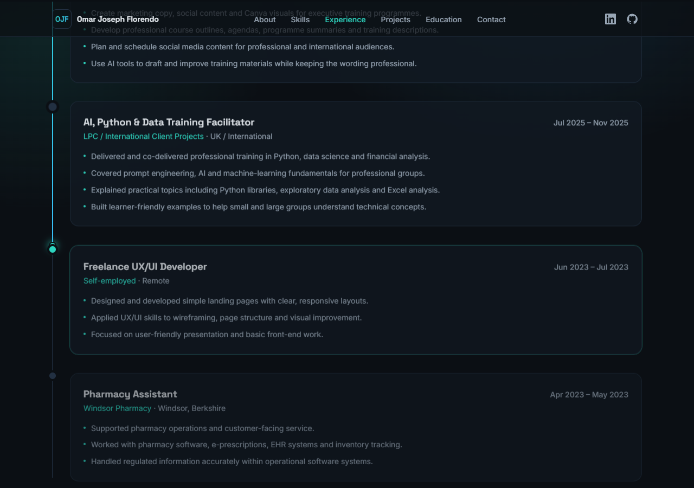
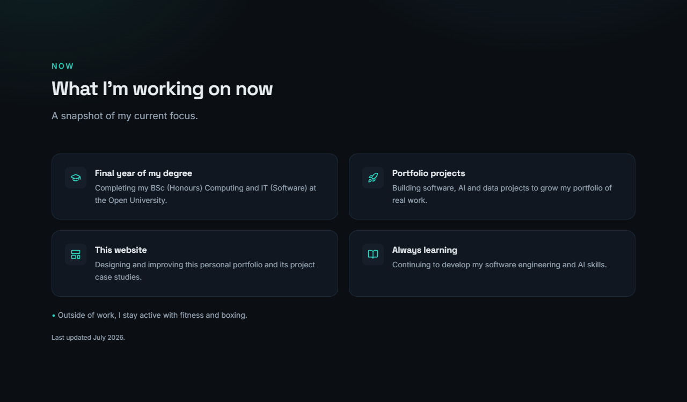
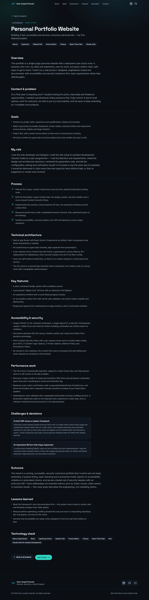
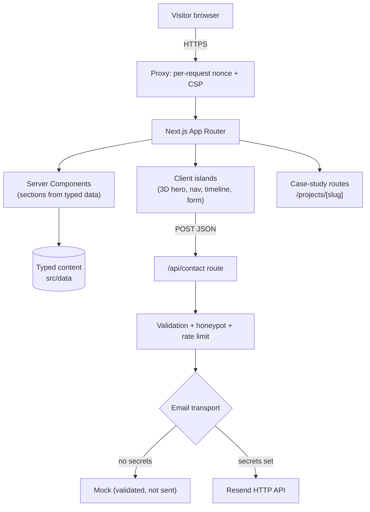

# OJ Florendo — Portfolio &amp; Platform


A premium, accessible and security-conscious personal website — the foundation of
a long-term platform documenting **OJ Florendo’s** journey across software
engineering, AI, data, learning and entrepreneurship. It’s a fast, dark,
editorial single-page site with a procedural 3D hero, an interactive experience
timeline, an accessible contact form and dedicated project case-study routes.

## Purpose

This site introduces **OJ Florendo** — a final-year BSc Computing and IT
(Software) student — to employers, recruiters, freelance clients and
collaborators, and serves as a growing home for projects and case studies over
time. Visitors can understand who OJ is, review skills, experience and
qualifications, explore project case studies, open LinkedIn and GitHub, and get
in touch safely. It is built as a real product, with accessibility, performance
and security treated as first-class requirements.

## Live demo

> 🔗 **Live site:** https://ojfr.me &nbsp;·&nbsp; _deployment in progress_

## Screenshots

| Desktop | Mobile |
| --- | --- |
|  |  |

| Experience timeline | “Now” section | Case study |
| --- | --- | --- |
|  |  |  |

## Features

- **Single-page portfolio** — Hero, About, Now, Skills, Experience, Projects,
  Education and Contact, all driven by typed content data.
- **Procedural “Digital Core” 3D hero** — a dynamically-loaded WebGL scene with
  an attractive CSS fallback; paused when off-screen or the tab is hidden.
- **Procedural particle-wave hero background** — a shader-driven point field
  that reacts gently to the pointer, layered over a static CSS gradient that
  serves as its no-JS / no-WebGL state (see `docs/adr/0002-hero-particle-wave.md`).
- **Interactive experience timeline** — a scroll-linked progress marker that
  highlights the most relevant role, with a static reduced-motion presentation.
- **Accessible contact form** — full server-side validation, plus direct email,
  LinkedIn and GitHub actions.
- **Project case studies** — dedicated, data-driven routes with structured data.
- **Responsive** — from small phones to large monitors, with no horizontal
  overflow.
- **Reduced-motion aware**, keyboard accessible, and screen-reader friendly.

## Technology stack

| Area | Tools |
| --- | --- |
| Framework | Next.js (App Router) · React |
| Language | TypeScript (strict) |
| Styling | Tailwind CSS · self-hosted fonts via `next/font` |
| Motion | Framer Motion (restrained, reduced-motion aware) |
| 3D | Three.js · React Three Fiber · Drei |
| Icons | lucide-react |
| Tooling | ESLint · npm |

## Architecture overview

- **Server Components by default**; client components (`"use client"`) only where
  interactivity is required (3D hero, navigation, timeline, contact form).
- **Content is data, not markup** — all copy lives in typed modules under
  `src/data`, kept separate from presentation.
- **Security at the edge of the app** — a per-request nonce Content Security
  Policy is generated in `src/proxy.ts` (Next.js 16’s replacement for
  middleware); other security headers are set in `next.config.ts`.
- **Contact** is handled by a server route with a swappable email transport, so
  no email credentials ever reach the browser.



## Accessibility

Targets WCAG 2.2 AA. Includes semantic landmarks, a single logical `h1`, a
skip-to-content link, full keyboard support, visible focus indicators, meaningful
alt text, accessible form labels and errors, and `prefers-reduced-motion`
handling. Decorative elements (the 3D canvas, timeline marker and nodes) are
hidden from assistive technology.

- **Automated result:** `axe-core` reports **0 violations** on both desktop and
  mobile viewports.

## Responsive design

Verified with no horizontal overflow across representative breakpoints:

| Class | Viewport |
| --- | --- |
| Phone | 430 × 932 |
| Tablet (portrait) | 820 × 1180 |
| Tablet (landscape) | 1180 × 820 |
| Laptop | 1440 × 1170 |
| Large desktop | 1920 × 1610 |

The hero uses a stacked layout on phones, a balanced two-column layout on
tablets, and a width-clamped layout on large monitors to keep line lengths
readable.

## Security

- **Content Security Policy** — per-request nonce with `strict-dynamic`, and
  **no `unsafe-inline` for scripts** in production.
- **Security headers** — HSTS (production), `X-Content-Type-Options`,
  `X-Frame-Options: DENY`, `Referrer-Policy`, `Permissions-Policy`,
  `X-Permitted-Cross-Domain-Policies`; `X-Powered-By` is disabled.
- **No secrets in the repository.** Any email credentials are server-only
  environment variables (never `NEXT_PUBLIC_`).
- **Contact form** uses server-side validation, a honeypot and rate limiting;
  submitted content is never stored or logged.
- **Self-hosted fonts** via `next/font` — no runtime third-party font requests.

See [`SECURITY.md`](SECURITY.md) for the full posture and disclosure policy.

## Performance considerations

- Both 3D scenes are **dynamically imported**, frame-rate capped, and **paused
  when off-screen or the tab is hidden**, with a device-appropriate pixel-ratio
  cap. All wave motion runs in a vertex shader, so per-frame CPU cost does not
  scale with particle count.
- Decorative animations use **compositor-friendly transforms/opacity**; the
  timeline is driven by motion values rather than per-frame React state.
- Expensive backdrop blur and permanent compositor layers were removed to keep
  scrolling and interaction responsive.
- A production Lighthouse audit on the deployed site is planned as a follow-up
  step.

## Getting started

**Requirements:** Node.js 24 LTS (see `.nvmrc`) and npm.

```bash
npm ci          # install exact, locked dependencies
npm run dev     # start the dev server (http://localhost:3000)
```

Build and serve the production version:

```bash
npm run build
npm run start
```

## Environment variables

Copy `.env.example` to `.env.local` and set real values there (never commit real
env files). All values below are placeholders.

| Variable | Required | Purpose |
| --- | --- | --- |
| `NEXT_PUBLIC_SITE_URL` | optional | Overrides the canonical site URL (defaults to `https://ojfr.me`); useful for preview deployments. |
| `RESEND_API_KEY` | optional | Enables real contact-email delivery (server-only). Without it, the form uses a safe mock transport. |
| `CONTACT_TO_EMAIL` | optional | Inbox that receives contact enquiries (server-only). |
| `CONTACT_FROM_EMAIL` | optional | Verified sender address for enquiries (server-only). |

## npm scripts

| Script | Description |
| --- | --- |
| `npm run dev` | Start the development server |
| `npm run build` | Production build |
| `npm run start` | Serve the production build |
| `npm run lint` | Run ESLint |
| `npm run typecheck` | Type-check with `tsc --noEmit` |

## Project structure

```text
src/
├── app/
│   ├── api/contact/route.ts      # contact form POST handler
│   ├── projects/[slug]/page.tsx  # project case-study route
│   ├── layout.tsx  page.tsx  globals.css
│   ├── robots.ts  sitemap.ts  manifest.ts
│   ├── opengraph-image.tsx  icon.svg  not-found.tsx
├── components/
│   ├── layout/                   # nav, footer, skip link
│   ├── sections/                 # hero, about, now, skills, experience, …
│   ├── case-study/               # reusable case-study template
│   ├── three/                    # Digital Core + particle wave scenes, shared
│   │                             #   frame limiter/hooks, CSS fallback
│   └── ui/                       # small reusable pieces
├── data/                         # typed content (site, skills, experience, …)
├── lib/                          # contact schema, email transport, helpers
├── types/                        # shared TypeScript types
└── proxy.ts                      # per-request nonce Content Security Policy
```

## Contact-form architecture

- The client form (`src/components/sections/ContactForm.tsx`) performs inline
  validation for UX, then submits JSON to the server.
- The server route (`src/app/api/contact/route.ts`) is the **authoritative**
  check: it re-validates and normalises every field, enforces length limits,
  applies a honeypot and per-window rate limit, and returns generic errors.
- Validation rules are shared via `src/lib/contact/schema.ts`.
- Email delivery is abstracted in `src/lib/email/index.ts`. With no secrets
  configured it uses a **mock transport** that validates the flow but does not
  send (and reports so honestly); configuring the environment variables enables
  real delivery through the Resend HTTP API. Submissions are **not** stored.

## Case-study routes

Each project can define a `caseStudy` in `src/data/projects.ts`. When present,
its card links to `/projects/<slug>`, rendered by a single reusable template
(`src/components/case-study/CaseStudyView.tsx`) with per-page metadata, canonical
handling and `CreativeWork` structured data. Adding a case study is purely a data
change.

## Deployment

This is a server-rendered Next.js application (it uses a request-time nonce CSP,
a server API route and dynamic rendering), so it requires a Node.js host — it is
**not** a static export. It can be deployed to any Node-capable platform. Set the
canonical URL via `NEXT_PUBLIC_SITE_URL` if it differs from the default, then
verify the security headers and enforced CSP after deploying, and confirm only a
redacted, public CV (if any) is present under `public/`.

## Roadmap

- Grow the platform beyond the portfolio: project write-ups, learning notes and
  updates over time.
- Add real project case studies as new work ships.
- Provide a redacted, phone-free public CV for download.
- Enable live contact-email delivery via the configured transport.
- Continue accessibility, performance and SEO refinement, including a deployed
  Lighthouse audit.

## Author

**OJ Florendo** — Windsor, Berkshire, United Kingdom
Final-year BSc (Honours) Computing and IT (Software) student.

- Website: https://ojfr.me
- LinkedIn: <https://www.linkedin.com/in/ojflorendo>
- GitHub: <https://github.com/omarjosephf>
- Email: ojflorendo.connect@gmail.com

## License

© 2026 OJ Florendo. **All rights reserved.** See [`LICENSE`](LICENSE).

No open-source licence has been granted for this repository. You may not copy,
modify, redistribute or reuse the code or content without explicit written
permission from the author.
