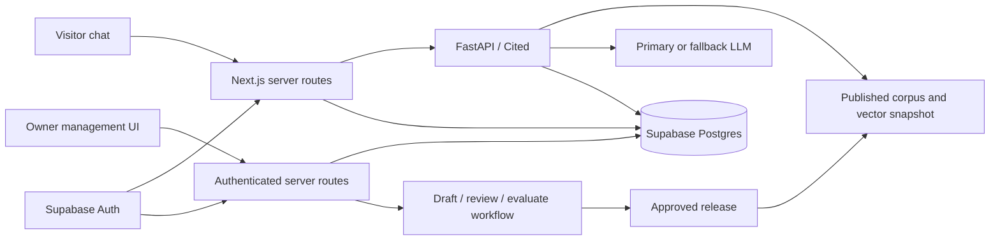

# E.V conversation storage and RAG management platform roadmap

Status: delivery roadmap approved by OJ Florendo on 8 September 2026. The owner
requires a preview for review before public release. This records the approved
direction; it does not claim these capabilities are deployed or activate visitor
transcript collection.

The hosting evaluation below was added in response to the owner's accompanying
pricing question. A final hosting migration and paid tier have not been selected.

## Product outcome

OJ can review recent conversations, identify recurring questions and knowledge
gaps, improve approved source material, and verify whether a change improves
answers. Visitors can resume saved chats according to a clearly disclosed storage
and identity policy.

The existing Cited inspector remains useful for examining documents, chunks and
vector artifacts. It is a local, read-only snapshot tool; the management platform
is a new authenticated application with persistent data and operational workflows.
The requested review and content-maintenance work supplies the operational need
for this roadmap under Handbook §§48 Track G and 49.4.

## Preview and hosting review

Deliver a local preview with synthetic conversations before the owner reviews a
public release. The management interface and retained chats remain authenticated
when deployed; publication does not make owner records publicly accessible.

The owner wants to avoid paying two application hosts. Evaluate Vercel for the
portfolio, E.V API, Cited demo and management UI, alongside Supabase for data/auth.
Keep Python/FastAPI where useful. Compare this with the existing Fly deployment
before new production infrastructure purchases. Supabase persistence makes a
shared transactional spending ledger possible, but replacing the current local
SQLite admission system requires qualification under concurrency and failures.

See the [hosting and cost review](../reviews/ev-hosting-and-cost-review.md) for
current pricing, commercial-use eligibility, runtime constraints and migration
checks. The current Fly configuration remains in place during evaluation. A
successful consolidation must account for both Cited and E.V, their separate
corpora and budgets, and eventual retirement of unnecessary billable resources.

## Architecture direction

Keep Python/FastAPI/Cited for retrieval, grounded answering, provider routing and
spending enforcement. Add Supabase Postgres for application records and Supabase
Auth for identity and access. Python is compatible with Supabase; it is not a
reason to avoid durable storage. Supabase provides an official
[Python client](https://supabase.com/docs/reference/python/introduction).

Arrows to the database describe separate responsibilities: the portfolio server
owns visitor identity and conversation APIs; the answering service reports trusted
answer outcomes and operational metadata under a narrowly scoped service identity.
Visitors cannot submit authoritative assistant answers, cost figures or owner roles.

Conversation persistence does not require moving vectors to Postgres. The current
67-chunk corpus can continue using its verified local vector artifact. Consider
pgvector when dynamic publication, corpus growth or measured operational needs
justify it. Changing databases, embedding models and chunking are separate changes.
The content-free spending ledger remains authoritative for admission until any
future migration is separately qualified.

## Instructor requirements and current candidate

This is a source inspection of the local candidate, not a statement of live
production behavior.

| Requirement | Observed state | Planned completion |
| --- | --- | --- |
| 1. Second LLM | Gemini primary / OpenAI Luna availability fallback implemented locally; release qualification outstanding | Complete routed answer evaluation, failure handling, budget checks and approved release. Two providers improve availability but cannot guarantee uninterrupted service. |
| 2. Save conversations per user | Bounded tab storage exists; no server transcript database or owner inbox | Implement durable records and access isolation. Define guest recovery versus account recovery explicitly. |
| 3. Remove Beta | Badge remains | Meet ADR graduation criteria, retain truthful capability disclosure, and remove the badge in the qualified release. |
| 4. Remove unnecessary UI | Candidate has a compact introduction, ordinary conversation layout and on-demand information | Review the final UI against concrete visitor tasks; retain clear-chat, contact and accessible controls. |
| 5. Remove loading part | A “Thinking…” reply placeholder remains; request deadlines are bounded | Remove the decorative loading bubble; retain a discreet accessible pending state, duplicate-submit protection and a bounded failure outcome. Assess actual latency separately. |
| 6. Remove “not in OJ's approved content” | That exact phrase is absent from candidate fallback copy; published-material wording remains | Review friendlier app-owned fallback copy without implying knowledge that is absent. |
| 7. Choose embedding model | BGE small English v1.5 is current | Retain baseline pending a controlled comparison; see retrieval review. |
| 8. Review system prompt | Reviewed with provider envelope and history formatting | Apply focused changes only after representative evaluation; see prompt review. |

Related records:
[conversational turns](../adr/0007-conversational-turns-for-the-assistant.md),
[retrieval and graduation](../adr/0006-retrieval-grounded-portfolio-assistant.md),
[provider routing and budgets](../adr/0015-durable-budget-and-provider-order.md),
[prompt and retrieval review](../reviews/ev-prompt-and-retrieval-review.md).

## The management workspace

| Area | What the owner can do | Evidence shown |
| --- | --- | --- |
| Overview | See recent activity and issues needing attention | Date range, number of sessions, answered / not covered / unavailable / policy outcomes, latency and last data refresh |
| Conversations | Search and filter authorized retained chats; inspect one conversation in order | Messages, timestamps, final answer, citations, feedback, request identifier and release versions |
| Questions and gaps | Group repeated questions; label and prioritize a gap | Distinct sessions, repeat counts, representative redacted examples and a reason: missing content, retrieval miss, confusing source, policy boundary or provider failure |
| Knowledge | Create a manual information draft and inspect existing sources | Owner-authored evidence, provenance, source version, publication status, chunk preview and exact token lengths |
| Content signals | Compare how content is requested and used | Separate retrieval, citation, optional source-open and feedback metrics with denominators and sample counts |
| Quality and releases | Compare changes before publication and revisit regressions | Retrieval results, human answer review, prompt/model/index versions, release history and rollback target |
| Operations | Diagnose availability and persistence problems | Provider attempt outcomes, fallback rate, latency, save failures, ingestion jobs, retention job health and spending reservations versus usage estimates |

Grouping traces into sessions and attaching human scores is a useful established
pattern in [Langfuse's session design](https://langfuse.com/docs/observability/features/sessions).
Its [evaluation workflow](https://langfuse.com/docs/evaluation/overview) also links
production examples, datasets and experiments. These are design references, not a
decision to send visitor transcripts to another analytics provider.

Evaluate the managed Supabase dashboard for database operations and existing
observability tools for engineering review before duplicating them. The custom
workspace should supply E.V-specific gap triage and approved knowledge publishing.
Do not add a second transcript store merely to reproduce charts.

### Honest metrics

“Most asked” should show both message count and distinct conversation count.
Filter synthetic tests and known automated traffic. Define the time zone, reporting
window, deduplication and topic-grouping version. Let the owner correct group labels.

“Least interesting” cannot be established from low retrieval counts. A document may
be new, hard to retrieve, poorly chunked or never exposed. Label the panel “Content
signals”: least asked-about, least retrieved and least cited are different measures.
Count each source at most once per answer for citation share. Source click-through,
if introduced, needs source-link impressions as its denominator. Show “insufficient
data” where samples are too small. Report unavailable and policy outcomes separately
from genuine knowledge gaps.

Start with SQL counts and owner labels. Evaluate automated topic grouping later on
redacted inputs; account for its embedding or LLM cost and classification errors.

## Saving chats and identity

Keep these requirements separate:

- Visitor continuity: who can retrieve a saved conversation, from which browser or
  device, for how long, and how to clear or delete it.
- Owner review: why transcripts are retained, who may inspect them, and when they
  expire.
- Aggregate reporting: which reduced metrics remain after individual records expire.

The initial proposal is guest continuity in the same browser without a sign-up
screen. This extends the existing tab-only policy and requires its own explicit
product and privacy decision before activation. Optional cross-device sign-in can
follow if needed.

Supabase anonymous sign-in is a possible implementation: it creates an underlying
authenticated user without asking for email or password. Losing the browser session
or changing devices prevents recovery unless an identity was linked. “Anonymous
sign-in” does not mean the contents of a conversation are anonymized.
[Supabase anonymous authentication](https://supabase.com/docs/guides/auth/auth-anonymous)

Design the session lifecycle, server-side verification, expiration, revocation and
abuse limits before selecting client storage. Do not use a public conversation ID
or a user_id supplied in JSON as proof of ownership. Use managed owner authentication
with MFA and recovery; do not build a bespoke password system.

Before collection, approve a finite retention window, notice, purpose and lawful
basis, provider/region terms, deletion/export behavior and backup treatment. Review
all existing “no server transcript” copy together. Sensitive text requires restricted
handling and minimization even for guests. A retention period is a product decision,
not a universal legal default; pseudonymized records can remain personal data.
[ICO storage limitation](https://ico.org.uk/for-organisations/uk-gdpr-guidance-and-resources/data-protection-principles/a-guide-to-the-data-protection-principles/storage-limitation/)

Avoid raw transcripts in request logs, error monitoring and public exports.
Longer-lived aggregates must remove free-text identifiers and rare identifying
combinations; do not call them anonymous solely because a user ID was removed.

## Data and access contract

Proposed entities, to be refined in the implementation ADR:

| Entity | Purpose and boundary |
| --- | --- |
| conversations / messages | Owner principal, ordered messages, created/expiry timestamps, save state and notice version; private |
| answer_events / model_attempts | Trusted outcome, route, citations, duration, usage uncertainty and release identifiers; private operational data |
| feedback / gap_reviews | Visitor score and owner diagnosis, kept separate from approved knowledge |
| knowledge_drafts / source_versions | Proposed changes, provenance, reviewer and approval state |
| chunks / index_versions | Reproducible derived artifacts and manifest; optional DB vectors |
| ingestion_jobs / evaluation_runs | Bounded work, attempt state, results and publish eligibility |
| audit_events / retention_jobs | Administrative actions, deletion status and operational evidence with minimal personal data |

Enforce least-privilege grants and row-level policies on every exposed table.
Test reads and writes for visitor A, visitor B, owner, signed-out and expired
sessions, including joins, views and RPCs. Administrative secret keys bypass RLS
and belong only on the server. Owner authority must come from a trusted role
assignment, not editable user metadata.
[Supabase RLS guidance](https://supabase.com/docs/guides/database/postgres/row-level-security)

Use stable message/request IDs and uniqueness constraints so a network retry does
not create duplicate messages or another paid answer. Visitors write questions and
feedback through validated APIs; only trusted processing writes assistant outcomes.
Define incomplete turns and recovery after a process crash. A failed save must not
display “Saved” or silently trigger another LLM call. If saving is unavailable,
disclose the state and offer ephemeral chat within the existing privacy boundary.

Pagination, bounded searches and safe text rendering are required. CSV exports must
neutralize spreadsheet formulas. Keep owner pages out of shared caches. Include
CSRF controls, session revocation, audit visibility and recovery tests.

## Manual knowledge improvement

1. Open an unanswered or poorly answered conversation and classify its cause.
2. Write a draft fact or answer, attach its authoritative evidence, and record
   provenance. A visitor assertion or model suggestion is not approved knowledge.
3. Preview cleaned source text, chunks, token lengths and likely citations.
4. Build a staged index and test the original question, paraphrases, nearby facts,
   unknown questions and the regression suite.
5. Review factual accuracy and evaluation results, then publish an approved version.
6. Verify the active version and allow rollback to the prior complete source/index
   pair. Preserve an audit record of who changed what.

Initially, Git remains the canonical source of published knowledge. The platform
stores drafts and prepares a reviewable content change for the existing release
workflow; it does not create a second editable source of truth. Later database
authoring requires an explicit migration decision. Drafts must never enter public
retrieval automatically.

Ingestion runs as bounded background work with idempotent jobs, visible failures
and an atomic version switch. Restrict future uploads by type and size, validate
actual file contents, and isolate parsing. Never offer unrestricted URL fetching.
Embedding or prompt changes must rebuild compatible artifacts, preserving exact
source and configuration hashes.

## Delivery order and completion checks

| Phase | Deliverable | Completion evidence |
| --- | --- | --- |
| A. Stabilize E.V | Qualified provider pair and simpler conversation UI | Answer/citation review, failure and latency checks, accessible interaction, spending gate and graduation evidence |
| B. Define storage boundary | Persistence/auth ADR, schema, access matrix, retention and recovery plan | Synthetic-data review; identity experience and operating cost fit agreed |
| C. Save and review | Durable conversations plus authenticated owner inbox | Restart/reload recovery, cross-user denial, truthful save failures, deletion/export and backup restoration checks |
| D. Explain demand | Question groups, gap queue and content-signal reports | Known fixtures reconcile to counts; labels and denominators are explicit; low samples do not imply preference |
| E. Improve knowledge | Draft, evaluate and publish workflow | A seeded gap becomes a cited answer after approved publication; failed builds never change the active index; rollback works |
| F. Optimize retrieval | Controlled chunk/model/retrieval experiments | Held-out improvement without critical regressions or unacceptable cost and latency |

Start implementation with synthetic conversations. Decide the production service
tier using the full operating budget. Supabase Free currently includes a 500 MB
database and may pause after a week of inactivity; Pro starts at US$25/month.
[Supabase pricing, checked 8 September 2026](https://supabase.com/pricing)

Free projects need a deliberate backup process. Supabase documents daily backups
for paid plans and recommends external dumps for Free; database backups do not
include Storage objects. Test restoration and deletion handling across backups.
[Supabase backups](https://supabase.com/docs/guides/platform/backups)

Implementation must include the dedicated R2 ADR, threat model and runbook required
by the handbook. Provisioning, transcript activation and publication remain
separate release actions. This roadmap preserves existing accepted behavior until
a reviewed implementation replaces it.

